# Create a Kubernetes Cluster

## Introduction

In this lab you will create a Kubernetes Cluster to deploy the microservices you will create in a later lab.

Estimated time: 20-25 min

### Objectives

* Learn how to create a Kubernetes Cluster

### Prerequisites

* This lab requires completion of the **Get Started** section in the Contents menu on the left.
* [Familiarity with OCI console](https://docs.oracle.com/en-us/iaas/Content/GSG/Concepts/console.htm)
* [Overview of Networking](https://docs.oracle.com/en-us/iaas/Content/Network/Concepts/overview.htm)
* [Oracle Cloud basics](https://docs.oracle.com/en-us/iaas/Content/GSG/Concepts/concepts.htm)
* [Connecting to a compute instance](https://docs.oracle.com/en-us/iaas/Content/Compute/Tasks/accessinginstance.htm)
* Your **Oracle Cloud Account** - During this workshop we will create a Level 100 environment for you to use on your tenancy.
## Task 1: Create Kubernetes Cluster (OKE)

1. To create an OKE cluster, open up the navigation menu in the top-left corner of the Console and go to **Developer Services** section, then click on **Kubernetes Clusters**.

  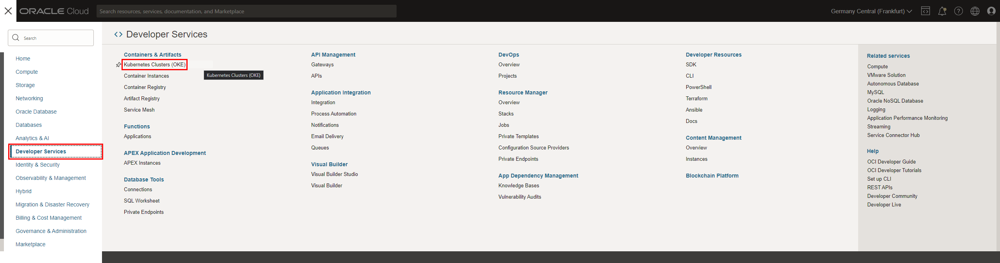

2. Check that the **Workshop** compartment is selected under **List Scope**. Then click **Create Cluster**:

  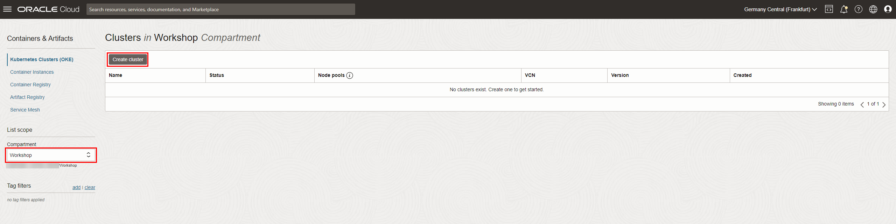

3. Choose **Quick Create** as it will create the new cluster along with the new network resources such as Virtual Cloud Network (VCN), Internet Gateway (IG), NAT Gateway (NAT), Regional Subnet for worker nodes, and a Regional Subnet for load balancers. 

  Click on **Submit**.

  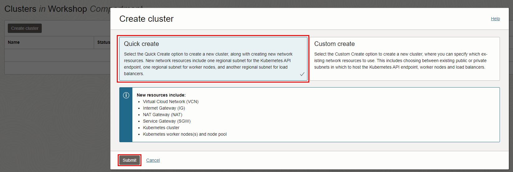

4.  This brings up the __Create Cluster (quick)__ screen where you will specify the configuration of the cluster.

 
5. Give basic information for the OKE cluster:

    - __Choose a compartment__ - Choose the compartment **Workshop** created in __Ignite Basics__. See [the documentation](https://docs.oracle.com/en-us/iaas/Content/Identity/Tasks/managingcompartments.htm) if you want to learn more about compartments.
    - __Name__ - Enter a memorable name for the database for display purposes. For this lab, use __Ignite-Cluster__.
    - __Kubernetes version__ - Leave the default option.    

    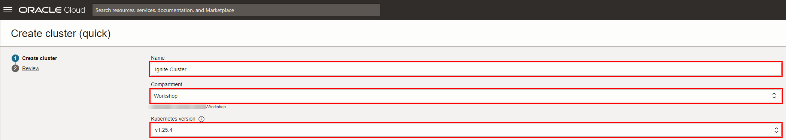

6. Choose the **Public Endpoint** in the Kubernetes API endpoint to easily access the kubectl, if you use a Bastion or an admin instance to access the kubectl commands, select the **Private Endpoint**.

  Select **Managed** for the **Node type**, and **Private workers** for the **Kubernetes worker nodes**.

*Optionally choose visibility of the Kubernetes Worker Nodes to Public Workers if you want public access to your nodes and number of nodes to 2 or 1 if you want reduced number of nodes*
    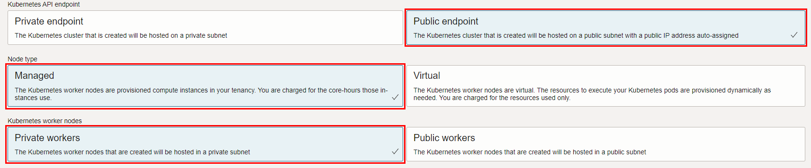

## Task 2: Create OKE Clusters

1. In the OCI Dashboard Menu go to: Developer Services-\> Container Clusters (OKE).

  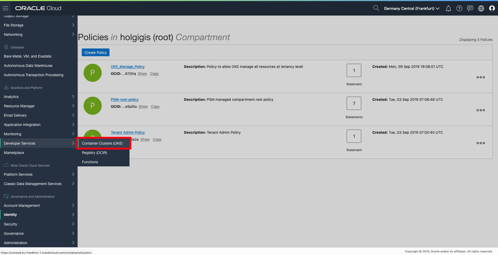

2. Select the compartment you created in lab 2 under List Scope and click **Create Cluster**.

  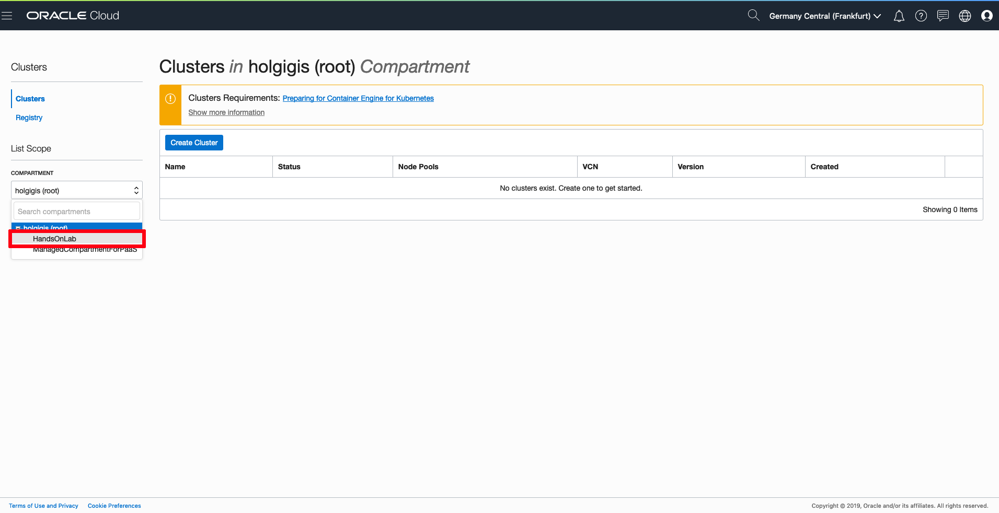

3. Provide a name for the cluster, then select the QUICK CREATE option and click the **Launch Workflow** button.

  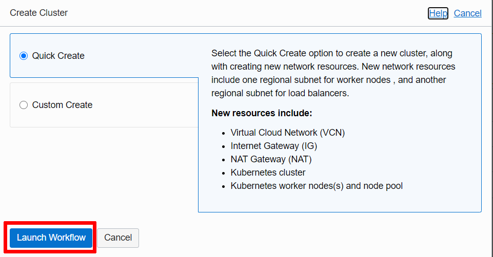

4. Select VM.Standard2.1 for SHAPE and 3 (or less if you don't want to create a 3 workernodes nodepool) for the NUMBER OF NODES (this number is the VMs that will be created into the node pool). Then click **NEXT**. Leave the rest of the parameters as defaults.

  

5. Review the cluster information before to create it, and click **Create Cluster** or back to modify cluster options.

  

6. The previous QUICK CREATE Option will setup a 3 nodes Kubernetes Cluster with predefined Virtual Cloud Network, 3 Subnets, Security Lists, Route tables. When you are done with checks, please click **Close**.

  *Note: Cluster creation process can take several minutes.*

  

  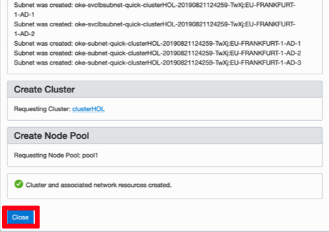

7. Then you are taken to the Cluster Information page. Please copy Cluster id and don’t forget to make a note in a txt file as you will need this data later.

  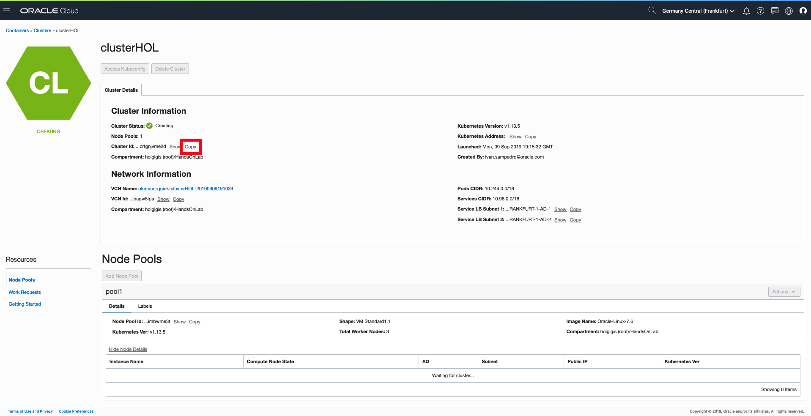

8. It will take several minutes for the cluster to be created and you may need to refresh the page. Once created, you can scroll down and select **Node Pools** under the Resources area, you can check that a node pool with three node clusters has been created.

  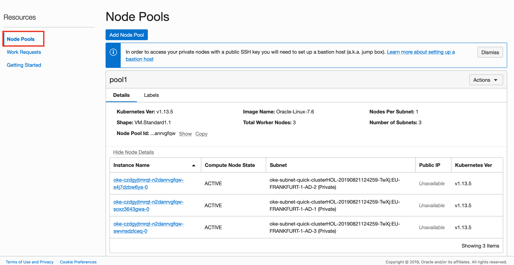

  *Note: you may find that Compute nodes have not been created yet as. This process can take several minutes as compute instances have to be created and then started:*

  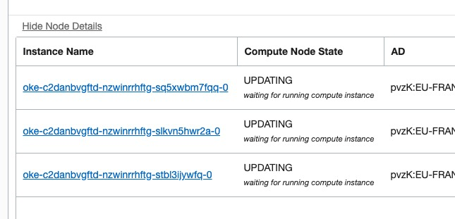

9. Now your Kubernetes Cluster is created. But we need to run some extra steps to get started with managing the Kubernetes Cluster.

  Click **Quick Start** under the Resources area. This section explains the steps to access your Cluster dashboard by using Kubectl. It is also explains how to install OCIcli and kubectl to access to Kubernetes management tool:

  

  You can proceed to the next lab.

## Want to Learn More?

* [Oracle Developer Cloud Service Documentation](https://docs.oracle.com/en/cloud/paas/developer-cloud/index.html)
* [Oracle Container Engine for Kubernetes Documentation](https://docs.cloud.oracle.com/en-us/iaas/Content/ContEng/Concepts/contengoverview.htm)

## Acknowledgements
* **Authors** -  Iván Postigo, Jesus Guerra, Carlos Olivares - Oracle Spain SE Team
* **Contributors** - Jaden McElvey, Technical Lead - Oracle LiveLabs Intern
* **Last Updated By/Date** - Madhusudhan Rao, Apr 2022
